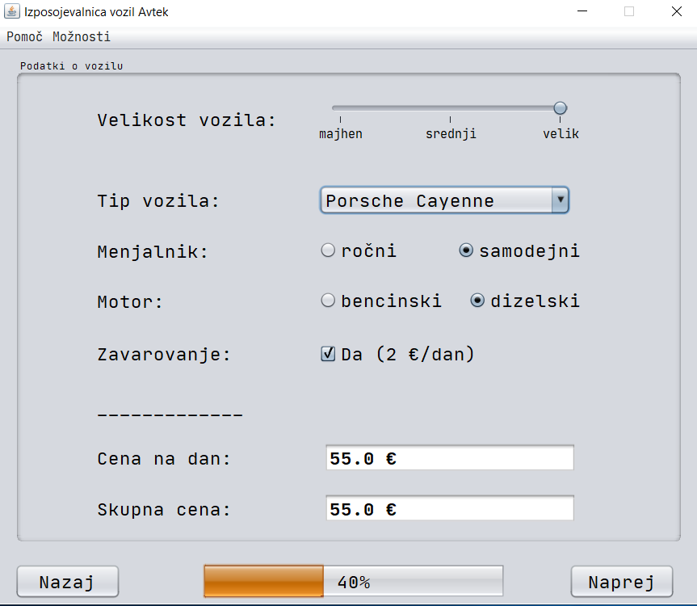

# Rent a car Java Swing GUI
This repository contains the code and report for the created Java Swing graphical user interface (GUI) for
car rental Desktop application. In general, the GUI is cross-platform compatible (mostly tested on Windows).
The GUI was created as a homework within the Computer Science masters programme.

To try the GUI yourself clone the repository and navigate to `dist` folder, where IzposojevalnicaAvtomobilov.jar
extecutable JAR file resides. After clicking on it, the GUI will be shown.

Images of the car-rental GUI are shown below:

